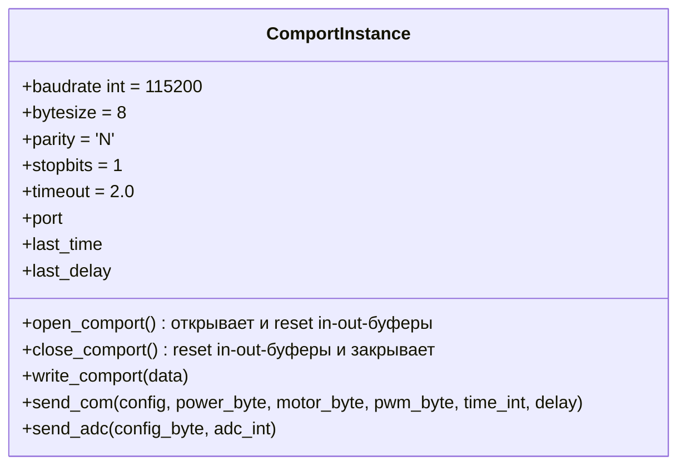
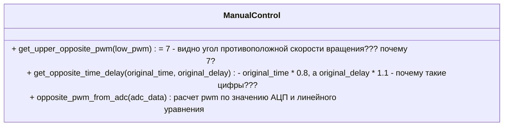

# Описание команд кисти

Описывается известная информация об управлении роботизированной кистью на основании собранных данных и проекта управления на Python.

На данный момент кисть представляет установку, которая может управляться тремя контроллерами. Введем термины: **верхний контроллер** - отвечает за разгибание пальцев установки, **нижний контроллер** - отвечает за сгибание пальцев установки, **задний контроллер** - отвечает за ротацию руки на указанный угол.

Верхний и нижний контроллер управляют тросами, которые сгибают и разгибают пальцы, при этом при затягивании троссов нижнего контроллера должны растягиваться пропорционально троссы верхнего контроллера для сгибания пальцев и наоборот. Оба контроллера могут выполнять операции движение влево (закручивание?), движение вправо (раскручивание?), остановку и фиксацию троссов в текущем положении. Задний контроллер умеет поворачивать установку на заданный примерный угол за счет команд: поворот влево, поворот вправо, зафиксировать и расслабить. 

> Вопрос 1. Движение влево соотвествует закручиванию тросса, а движение вправо - раскручивание? Или наоборот?

> Вопрос 2. Верхний контроллер отвечает за верхние троссы?


Для всех контроллеров определены свои COM-порты, они подключаются проводом USB type-c в три разьема. Именования подключенных устройств не определено, поэтому нужно самостоятельно определять, какой из контроллеров подключен к существующему активному COM-порту в списке.

Для работы с COM-портом верхнего или нижнего контроллера в представленном проекте управления Python определен следующий класс ComportInstance с заданными параметрами.



Команды управления верхним и нижним контроллерами указаны в классе CommandMaster, где:
* PWM - ШИМ - сигнал для управления мощностью
* ADC - АЦП - аналогово-цифровой преобразователь - что считывает? I - сила тока, в каких попугаях?

> Вопрос 3. Выдаваемые значения АЦП соотвествуют силе тока? В амперах?


На основании указанного кода можно выделить следующие параметры команд.

| название байта | описание | бит конфигурации | допустимые значения | аналогия |
| -- | -- | -- | -- | -- | 
| config | Конфигурация | - | 0-5 бит поднимаются под команды ниже (где 0 - младший бит, справа налево): 1 - присутствует параметр в запросе, 0 - отсутствует; 6,7 - не задействованы | заполнение пакета битами, количество поднятых бит равно количеству байт в пакете без учета текущего байта |
| power_byte | исполнение команды | (0) | 1/0 | а если 0 - то что и зачем? |
| motor_byte | Номер двигателя и команда вращения | (1) | 0-2 бита - номер мотора 0 до 4, 3-4 бита - (0 - стоп, 1 - вправо, 2 **-вправо?**, 3 - удержание) - что закручивает, а что раскручивает? | раскручивание и скручивание тросса за заданное время |
| pwm_byte | ШИМ | (2) | от 0 до 100 - какие попугаи? | скорость расручивания и закручивания троссов |
| time | Время работы | (3) | от 0 до 100, где 1 == 0.1 с |  |
| delay | Задержка исполнения команды | (4) | от 0 до 100, где 1 == 0.1 с |  |
|  adc  | Разрешение АЦП | (5) | поднятые биты моторов 0 до 4 бит для каждого пальца | получение измерений на АЦП? |

> Вопрос 4. Байт power (исполнения команды) может быть 0 или 1, 1 - команды исполнятся. А зачем нужно значение 0? При значении 0 команда проигнорируется?

> Вопрос 5. В Excel документе написано, что команда вращения имеет значение :"0 - стоп, 1 - вправо, 2 - **вправо**, 3 - удержание". Тогда 1 или 2 поворачивает влево?

ШИМ отвечает за скорость раскручивания и закручивания тросика на пальце, а номер двигателя и команда вращения выполнения действия с заданной задержкой и временем выполнения.

> Вопрос 6. Время time (время работы) включает delay (задержка исполнения команды)? Или общее время выполнения команды равно  delay + time_int?

Номера пальцев по порядку не соотвествуют номерам моторов (кажется, надо глядеть эту информацию в таблицах):
* 0 - большой 
* 1 - указательный
* 2 - средний
* 3 - безымяннй
* 4 - мизинец
*Но "Что надоходится в файлах - lower_finger и lower_rotation???"*
  
> Вопрос 7. В классе MainApp располагается метод `motor_settings_autoload`, где из файлов загружается информация из файлов `lower_finger` и `lower_rotation`. То есть номера пальцев не соотвествуют порядку моторов, а также они направлены в разные стороны. Первый отвечает за соотвествие номера пальца на руке номеру мотора на устройстве? А второй за направление вращения, которое соотвествует повороту влево и вправо?

> Вопрос 8. В файлах `lower_finger` и `lower_rotation` 6 записей, а пальцев 5 - что означает шестая позиция?

По файлам моторы верхнего контроллера
| номер пальца | номер мотора | команда вращения влево | команда вращения вправо | adc-канал |
| --- | --- | --- | --- | --- |
| 1 | 1 | 2 | 1 | 0 |
| 2 | 0 | 1 | 2 | 1 |
| 3 | 2 | 1 | 2 | 2 |
| 4 | 4 | 1 | 2 | 3 |
| 5 | 3 | 2 | 1 | 4 |
| 6 | 5 | 1 | 2 | 5 |

Моторы нижнего контроллера
| номер пальца | номер мотора | команда вращения влево | команда вращения вправо | adc-канал |
| --- | --- | --- | --- | --- |
| 1 | 1 | 2 | 1 | 1 |
| 2 | 0 | 1 | 2 | 0 |
| 3 | 2 | 2 | 1 | 2 |
| 4 | 4 | 2 | 1 | 3 |
| 5 | 3 | 2 | 1 | 4 |
| 6 | 5 | 1 | 2 | 5 |

> Вопрос 8. Правильно понимаю, что может отправляться набор команд по изменению PWM и вращению, которые накапливаются и исполняются только по команде POWER? Как много команд может быть мещено в стек команд до последующей команды POWER?

> Вопрос 9. Может ли команда POWER  применяться к конкретному мотору или всегда выполняется для всего контроллера в целом?

> Вопрос 10. Можно ли сочетать команду POWER с изменением ШИМа и ротацией в одной команде?

> Вопрос 11. Можно ли сочетать команды изменения ШИМа и ротации с командой запуска получения значений АЦП?

> Вопрос 12. Что будет, если в стеке команд до выполнения POWER будут противоречащие команды, например, команда поворота и команда удержания в одном стеке или команда поворота в разные стороны на одном моторе? Может быть ли в стеке команды на один и тот же мотор?

> Вопрос 13. В коде есть две функции в классе `MainApp`: upper_check_motor_rotation и lower_check_motor_finger? В чем суть этих проверок? Зачем для проверки (check) ротации используется установка ШИМа? И почему при проверке пальца используется установка ШИМа на 15? В чем отличие провеки пальца от проверки ротации?

Итого можно:
* замерить значение на АЦП
* изменить ШИМ
* изменить вращение по закручиванию и раскручиванию тросса
* запустить выполнение стека команд

Как было сказано ранее, если тросс один закручивается, то противоположный тросс на другом констроллере должен раскручиваться. И в классе ManualControl примедено следующие описания для решения этой задачи:



> Вопрос 13. Почему в функции `get_upper_opposite_pwm` используется константа 7? Что там должно быть?

> Вопрос 14. Почему в функции `get_opposite_time_delay` используются коэффициенты 0.8 и 1.1? Что там должно быть?

Формула линейного уравнения на данный момент:
```math
y = (((yMin - yMax) * (x - xMax)) / (xMin - xMax)) + y0
```
$xMax = 0.15$

$xMin = 0.04$

$yMax = 7$

$yMin = 90$

где y - значение ШИМ, а x - (I) - сила тока?

> Вопрос 15. Почему в функции `opposite_pwm_from_adc` значение y0 = 7 максимальное, а y1 = 90 минимальное (см. комментарий в коде)?

> Вопрос 16. Запуск команды sendADC влечет за собой непрерывное получение пакетов значений? Как остановить этот процесс?

> Вопрос 17. По итогу какой COM-порт используется для получения данных sendADC, так как есть разные подходы с и без "both".

> Вопрос 18. Какая структура пакета у входящего пакета у исходящей команды sendADC? Отправить все биты опущенными?

> Вопрос 19. В проекте представлено два варианта получения данных после sendADC: 20 байт с верхнего и нижнего контроллера по отдельности (с экспоненциальным скользящим средним, где одно значение 2-хбайтовое) и 40 байт с одного контроллера (both, 1 байтное значение, без фильтрации и почему-то с закрытием COM-порта в конце). В чем разница? Какой вариант использовать? Почему во втором случае закрывается COM-порт?

* 20 байт (с экспоненциальным скользящим средним и 2 байтовым значением)
```
$y[k] = (x[i - 1] + x[i] * 256) * 3.3 / 4096
i+=2, k++
+ ema_convertion
```

* 40 байт (both, без устреднения, 1 батовое значение, закрытие COM-порта в конце)
```
$y[k] = x[i] * 3.3 / 4096
i++, k++
закрытие COM-порта? почему?
```

Обработка:
```
ema_convertion(data)
alpha = 0.01
alpha * data[i] + (1 - alpha) * result[-1]
result - последнее значение. ФНЧ что-ли?  Экспоненциальная скользящая средняя (EMA)
```
> Вопрос 20. Коэффициент экспоненциального скользящего среднего (0.01) уже подобран? Его нужно использовать

> Вопрос 21. Пальцев 5. Каналов 6 в файле. Пакеты по 20 или 40 байт (где в 20 байтах - один отсчет 2 байта, итого 10 значений для 5 каналов, а в 40 байтах - отсчет 1 байт, итого 40 значений для 5 каналов). Какая частота данных в пакетах sendADC? В коде есть следующий код, который мне не ясен по расчету времени:

```
byte_count = int(upper_time * 50)
byte_count = int(max_time * 10000)
```

Формат команд у заднего контроллера
| номер байта | диапазон значение | описание |  аналогия |
| --- | --- | --- |  --- |
| 0 | 1 - влево, 2 - вправо, 3 - зафиксировать, 4 - освободить | команда |   |
| 1 |  | старший байт угла вращения | H << 8 + L  |
| 2 |  | младший байт угла вращения |   |
| 3 | 1 | скорость (не изменять) |   |
| 4 | 2 | значение выполнения команды |   |

> Вопрос 22. Какой диапазон значений углов у контроллера, вращающего руку? От 0 до 360? Или 0 не входит? Что будет, если подать 361?

