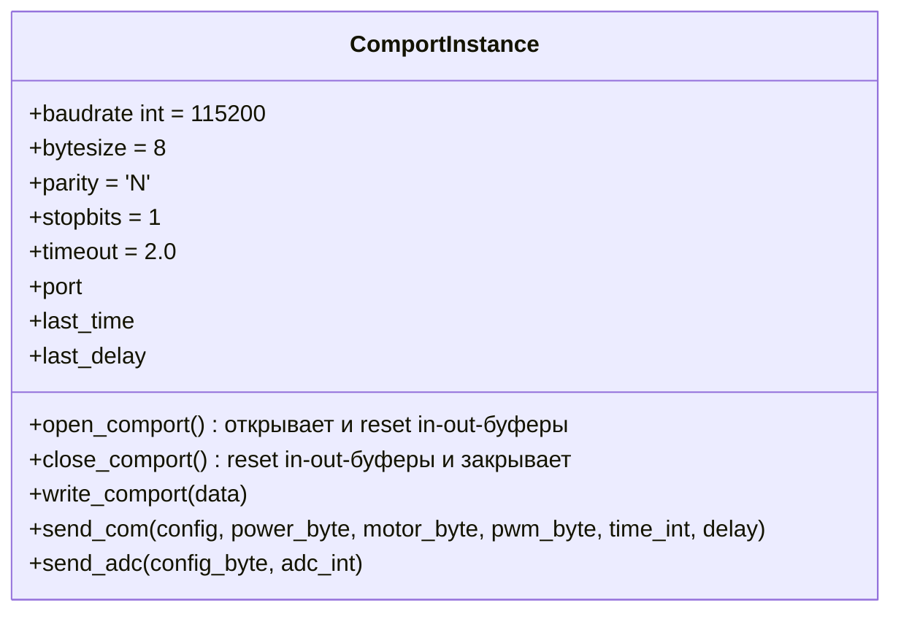
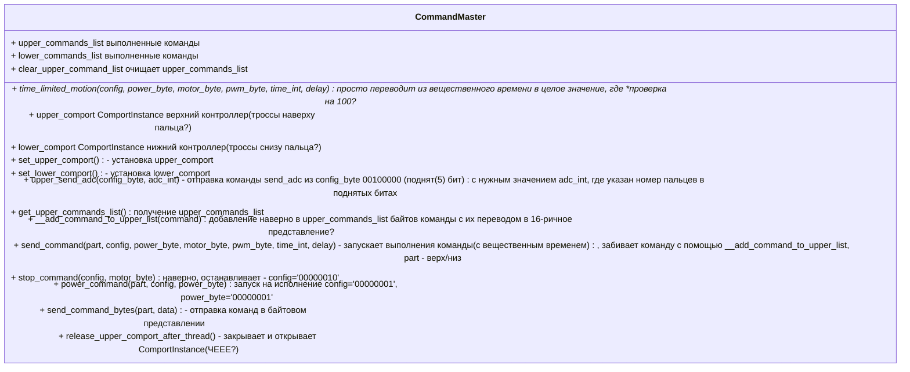
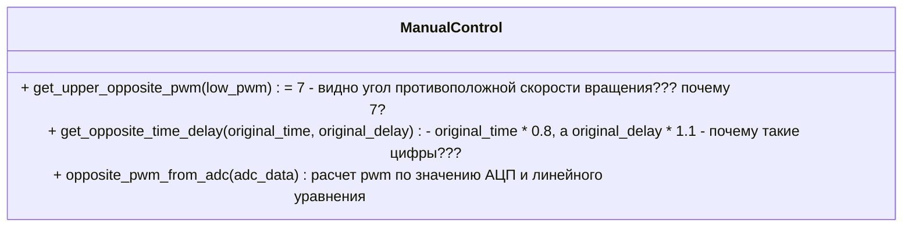

# Описание команд кисти

Описывается известная информация об управлении роботизированной кистью на основании собранных данных и проекта управления на Python.

На данный момент кисть представляет установку, которая может управляться тремя контроллерами. Введем термины: **верхний контроллер** - отвечает за разгибание пальцев установки, **нижний контроллер** - отвечает за сгибание пальцев установки, **задний контроллер** - отвечает за ротацию руки по углам.

Верхний и нижний контроллер управляют тросами, которые сгибают и разгибают пальцы, при этом при затягивании троссов нижнего контроллера должны растягиваться пропорционально троссы верхнего контроллера для сгибания пальцев и наоборот. Оба контроллера могут выполнять операции движение влево (закручивание?), движение вправо (раскручивание?), остановку и фиксацию троссов в текущем положении. Задний котроллер умеет поворачивать установку на заданный примерный угол за счет команд: поворот влево, поворот вправо, зафиксировать и расслабление. 

Для всех контроллеров определены свои COM-порты, они подключаются проводом USB type-c в три разьема. Именования подключенных устройств не определено, поэтому нужно самостоятельно определять, какой из контроллеров подключен к существующему активному COM-порту в списке.

Для работы с COM-портом верхнего или нижнего контроллера в проекте управления Python определен следующий класс ComportInstance с заданными параметрами.



Команды управления верхним и нижним контроллерами указаны в классе CommandMaster.
* PWM - ШИМ - сигнал для управления можностью
* ADC - АЦП - аналогово-цифровой преобразователь - что считывает? I - сила тока, в каких попугаях?


На основании указанного кода можно выделить следующие параметры команд.

| название | описание | допустимые значения | бит конфигурации | аналогия |
| -- | -- | -- | -- | -- | 
| config | Конфигурация | - | 0-5 бит поднимаются под команды ниже (где 0 - младший бит, справа налево), 1 - присутствует параметр в запросе, 0 - отсутствует, 6,7 - не задействованы | заполнение пакета битами, количество поднятых бит == количеству байт в пакете без учета текущего байта |
| power_byte | исполнение команды ? | (0) | 1/0 | а если 0 - то что и зачем? |
| motor_byte | Номер двигателя и команда вращения | (1) | 0-2 бита - номер мотора 0 до 4, 3-4 бита - (0 - стоп, 1 - вправо, 2 **-вправо?**, 3 - удержание) - что закручивает, а что раскручивает? | раскручивание и скручивание тросса за заданное время |
| pwm_byte | ШИМ | (2) | от 0 до 100 - какие попугаи? | скорость расручивания и закручивания троссов |
| time_int | Время работы | (3) | от 0 до 100, где 1 == 0.1 с |  |
| delay | Задержка исполнения команды | (4) | от 0 до 100, где 1 == 0.1 с |  |
|  adc_int  | Разрешение АЦП | (5) | поднятые биты моторов 0 до 4 бит для каждого пальца | получение измерений на АЦП? |

Направление пальцев в моторах должно быть:
* 0 - большой 
* 1 - указательный
* 2 - средний
* 3 - безымяннй
* 4 - мизинец
*Но "Что надоходится в файлах - lower_finger и lower_rotation???"*

ШИМ отвечает за скорость раскручивания и закручивания тросика на пальце, а номер двигателя и команда вращения выполнения действия с заданной задержкой и временем выполнения.
Время time_int включает delay или общее время - это delay+time_int?

Насколько понимаю, может отправляться набор команд, которые накапливаются и исполняются по команде POWER?
Команда POWER может применяться к конкретному мотору?
Можно ли сочетать команду изменения ШИМа с ротацией? Да.
Можно ли сочетать команду POWER с изменением ШИМа и ротацией? 
Можно ли сочетать команды изменения ШИМа и ротации с ADC? 
Что будет, если в стеке будет и команда поворота и команда удержания в одном стеке?
Зачем для проверки (check) ротации используется установка ШИМа?
И почему при проверке пальца используется установка ШИМа на 15? В чем отличие провеки пальца от проверки ротации?
Send ADC - работает?

Итого можно:
* замерить ADC
* изменить ШИМ
* изменить вращение по загручиванию и раскручиванию троса
* запустить выполнение

Как было сказано ранее, если тросс один закручивается, то противоположный тросс на другом констроллере должен раскручиваться. И в классе ManualControl следующие описания для решения этой задачи:



Формула линейного уравнения на данный момент:
```math
y = (((yMin - yMax) * (x - xMax)) / (xMin - xMax)) + y0
```
$xMax = 0.15$

$xMin = 0.04$

$yMax = 7$

$yMin = 90$

где y - значение ШИМ, а x - (I) - сила тока?

Почему y0 = 7 максимальный, а y1 = 90 минимальный? 

Для вращения пальца нужно передать параметры с противоположными значениями? 


Команда sendADC - какая структура пакета?
Для получения нового пакета нужно передать новое значение sendADC?

* 20 байт
```
$y[k] = (x[i - 1] + x[i] * 256) * 3.3 / 4096
i+=2, k++
+ ema_convertion
```

* 40 байт (both?)
```
$y[k] = x[i] * 3.3 / 4096
i++, k++
ema_convertion(data)
```

Обработка:
```
ema_convertion(data)
alpha = 0.01
alpha * data[i] + (1 - alpha) * result[-1]
result - последнее значение. ФНЧ что-ли? 
```

Какая частота данных в пакетах sendADC?
```
byte_count = int(upper_time * 50)
```

Как остановить sendADC? Отправить все биты опущенными?


