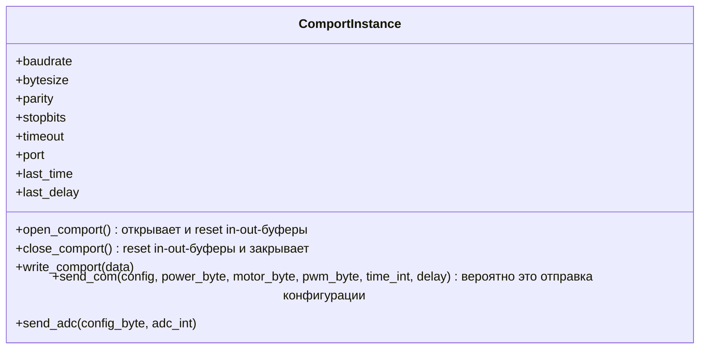

# wiki_cybermed

```mermaid
classDiagram
class ComportInstance {
  +baudrate 
  +bytesize
  +parity 
  +stopbits
  +timeout 
  +port 
  +last_time
  +last_delay
  +open_comport() открывает и reset in-out-буферы
  +close_comport() reset in-out-буферы и закрывает
  +write_comport(data)
  +send_com(config, power_byte, motor_byte, pwm_byte, time_int, delay) вероятно это отправка конфигурации
  +send_adc(config_byte, adc_int)
}
```

