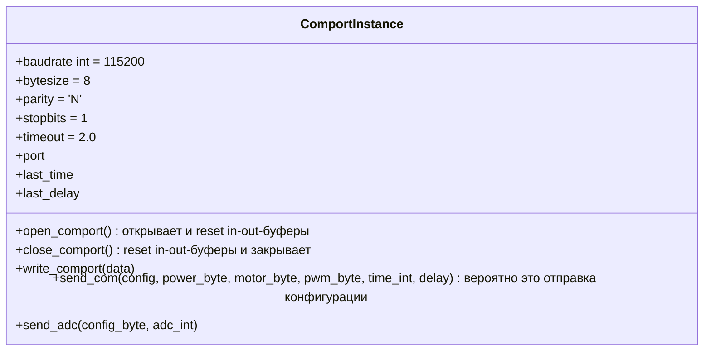
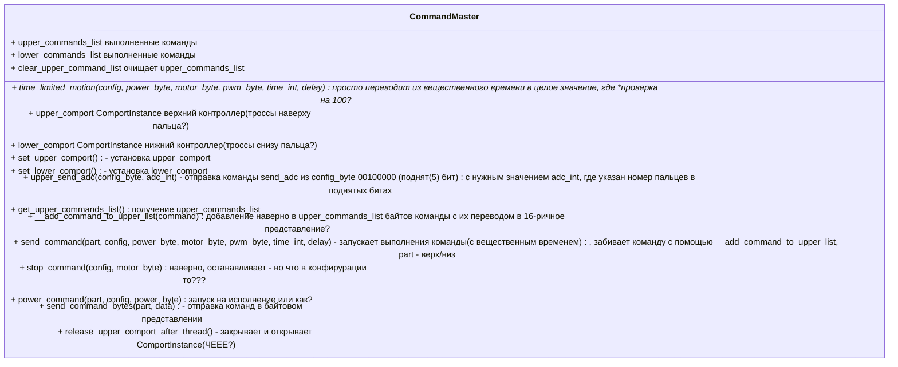

# Описание команд кисти

| название | описание | допустимые значения | бит конфигурации | аналогия |
| -- | -- | -- | -- | -- | -- |
| config | Конфигурация | - | 0-5 бит поднимаются под команды ниже (где 0 - младший бит, справа налево), 1 - присутствует параметр в запросе, 0 - отсутствует, 6,7 - не задействованы | заполнение пакета битами, количество поднятых бит == количеству байт в пакете, кроме текущего байта |
| power_byte | Исполнение команды ? | (0) | 1/0 | а если 0 - то что и зачем? |
| motor_byte | Номер двигателя и команда вращения | (1) | 0-2 бита - номер мотора 0 до 4, 3-4 бита - (0 стоп, 1 - вправо, 2 **-вправо?**, 3 - удержание) | раскручивание тросса за заданное время |
| pwm_byte | ШИМ | (2) | от 0 до 100 - какие попугаи? | скорость расручивания и закручивания троссов |
| time_int | Время работы | (3) | от 0 до 100, где 1 == 0.1 |  |
| delay | Задержка исполнения команды | (4) | от 0 до 100, где 1 == 0.1 |  |
|  adc_int  | Разрешение АЦП (5) |  | поднятые биты моторов 0 до 4 бит для каждого пальца | получение измерений на АЦП? |

ШИМ отвечает за скорость раскручивания и закручивания тросика на пальце, а номер двигателя и команда вращения выполнения действия с заданной задержкой и временем выполнения.
Время time_int включает delay или общее время - это delay+time_int?

