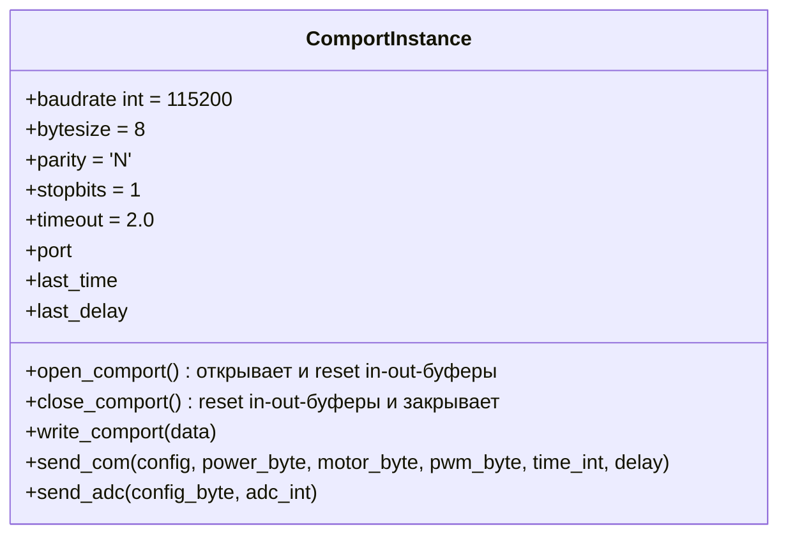
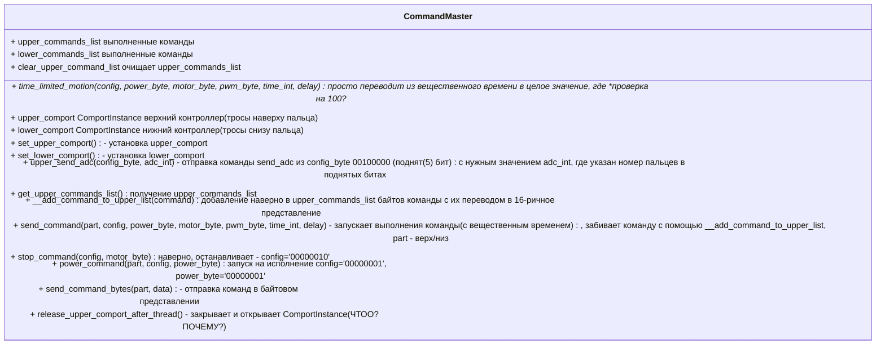
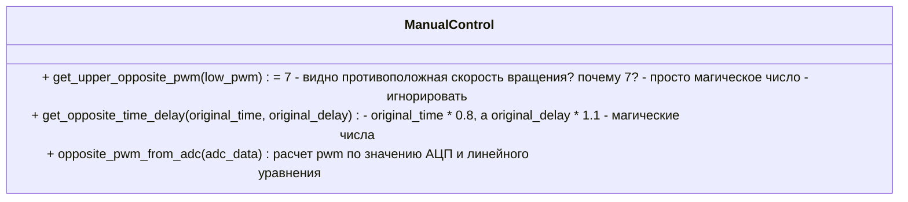

# Описание команд кисти

Описывается известная информация об управлении роботизированной кистью на основании собранных данных и проекта управления на Python.

На данный момент кисть представляет установку, которая может управляться тремя контроллерами. Введем термины:
* **верхний контроллер** - отвечает за разгибание пальцев установки,
* **нижний контроллер** - отвечает за сгибание пальцев установки,
* **задний контроллер** - отвечает за ротацию руки на указанный угол.

Верхний и нижний контроллер управляют тросами, которые сгибают и разгибают пальцы, при этом при затягивании тросов нижнего контроллера должны растягиваться пропорционально тросы верхнего контроллера для сгибания пальцев и наоборот. Оба контроллера могут выполнять операции движение закручивания тросов пальцев, раскручивания, остановку и фиксацию тросов в текущем положении. Задний контроллер умеет поворачивать установку на заданный примерный угол за счет команд: поворот влево, поворот вправо, зафиксировать и расслабить. 

Команды закручивания и раскручивания тросов на каждом моторе не одинаковы и могут быть инвертированы. Верхний контроллер отвечает на тросы, идущие сверху пальцев (ноготь), нижний - тросы снизу пальца (подушка).


Для всех контроллеров определены свои COM-порты, они подключаются проводом USB type-c в три разьема. Именования подключенных устройств не определено, поэтому нужно самостоятельно определять, какой из контроллеров подключен к существующему активному COM-порту в списке.

Для работы с COM-портом верхнего или нижнего контроллера в представленном проекте управления Python определен следующий класс ComportInstance с заданными параметрами.



Команды управления верхним и нижним контроллерами указаны в классе CommandMaster, где:
* PWM - ШИМ - сигнал для управления мощностью ( от 0 до 100), что соотвествует скорости скручивания и раскручивания троса
* ADC - АЦП - аналогово-цифровой преобразователь выдает падение напряжения - сила тока (I) в амперах

При выполнении движения мотора подается определенный ШИМ, который снимается АЦП. При завершении движения ШИМ сбрасывается в 0, а АЦП не передает значение (или передает 0, если какой-то из моторов еще работает).

Общая логика управления устройством следующая:
1. Настройка моторов (ШИМ, тип команды, время выполнения, задежка). Последняя поданная команда на мотор считается выполняемой, предыдущие игнорируются. Команды не копятся, а только изменяют параметры моторов.
2. Активация или деактивация АЦП на моторах.
3. Запуск движения (команда POWER).
4. Моторы выполняют движение в заданное им время. АЦП мотора выдает значения: в задежке и движении. Если движение завершено, но другой мотор работает - выдаются 0 значения АЦП.
5. Можно остановить движение командой СТОП.
6. Если движения на всех моторах завершены, данные АЦП не отправляются, ШИМ обнуляется.


### Формат управляющей команды 

На основании указанного кода можно выделить следующие параметры команд:

| название байта | описание | бит конфигурации | допустимые значения | аналогия |
| -- | -- | -- | -- | -- | 
| config | Конфигурация | - | 0-5 бит поднимаются под команды ниже (где 0 - младший бит, справа налево): 1 - присутствует параметр в запросе, 0 - отсутствует; 6,7 - не задействованы | заполнение пакета битами, количество поднятых бит равно количеству байт в пакете без учета текущего байта |
| power_byte | исполнение команды | (0) | 1/0 | выполняет команду POWER, общая команда на все моторы |
| motor_byte | Номер двигателя и команда вращения | (1) | 0-2 бита - номер мотора 0 до 4, 3-4 бита - (0 - стоп, 1/2 - вращение влево/вправо индивидуально для каждого мотора, 3 - удержание)  | раскручивание и скручивание троса за заданное время |
| pwm_byte | ШИМ | (2) | от 0 до 100 | скорость расручивания и закручивания тросов |
| time | Время работы | (3) | от 0 до 100, где 1 == 0.1 с, максимальное время выполнения - 10 с |  |
| delay | Задержка исполнения команды | (4) | от 0 до 100, где 1 == 0.1 с |  |
|  adc  | Разрешение АЦП | (5) | поднятые биты моторов 0 до 4 бит для каждого пальца | получение измерений на АЦП во время движения |

> Необходимо проверить, что будет, если отправить байт power (исполнения команды), равный ноль, как во время движения, так и при разных настройках до и после.

ШИМ отвечает за скорость раскручивания и закручивания тросика на пальце, а номер двигателя и команда вращения выполнения действия с заданной задержкой и временем выполнения. Общее время выполнения команды равно  delay + time.

Номера пальцев по порядку не соотвествуют номерам моторов и каналам АЦП. Если указать номера пальце в следующем порядке:
* 0 - большой 
* 1 - указательный
* 2 - средний
* 3 - безымяннй
* 4 - мизинец

то по файлам моторы верхнего контроллера имеют следующую систему команд и идентификации:
| номер пальца | номер мотора | команда вращения влево (закручивать) | команда вращения вправо (разкручивать) | adc-канал (по мотору) |
| --- | --- | --- | --- | --- |
| 1 | 1 | 2 | 1 | 0 |
| 2 | 0 | 1 | 2 | 1 |
| 3 | 2 | 1 | 2 | 2 |
| 4 | 4 | 1 | 2 | 3 |
| 5 | 3 | 2 | 1 | 4 |
| 6 | 5 | 1 | 2 | 5 |

моторы нижнего контроллера:
| номер пальца | номер мотора | команда вращения влево (закручивать) | команда вращения вправо (разкручивать) | adc-канал (по мотору) |
| --- | --- | --- | --- | --- |
| 1 | 1 | 2 | 1 | 1 |
| 2 | 0 | 1 | 2 | 0 |
| 3 | 2 | 2 | 1 | 2 |
| 4 | 4 | 2 | 1 | 3 |
| 5 | 3 | 2 | 1 | 4 |
| 6 | 5 | 1 | 2 | 5 |

6 мотор закладывался под вращение кисти и на данный момент не используется.

Сочетания команд:
* команда ШИМ и вращения на одном моторе
* команда ШИМ/вращения с ADC
* команда ШИМ/вращения и ADC с POWER

Порядок выполнения: настройка -> ADC -> POWER. Команды не накапливаются. Пока работает команда POWER АЦП остановить нельзя, но можно остановить команду POWER.

В коде были приведены проверки check_motor_finger (дернуть пальцем путем изменения ШИМа на маленькое значение), позволяющая определить палец, и check_motor_rotation (вывести палец на определенный угол).

Итого можно:
* активировать изменения значений на АЦП при движении
* изменить ШИМ
* изменить вращение по закручиванию и раскручиванию троса
* запустить или остановить выполнение стека команд

### Обеспечение закручивания и раскручивания противоположного троса

Как было сказано ранее, если трос один закручивается, то противоположный трос на другом констроллере должен раскручиваться. И в классе ManualControl приведены следующие описания для решения этой задачи:



При движении для противоположного троса необходимо использовать `opposite_pwm_from_adc` для ШИМ, движение - обратное и время по `get_opposite_time_delay`.

Формула линейного уравнения на данный момент в `opposite_pwm_from_adc`:
```math
y = (((yMax - yMin) * (x - xMax)) / (xMin - xMax)) + yMin
```

$xMin = 0.04$

$xMax = 0.15$

$yMin = 7$

$yMax = 90$

где y - значение ШИМ, а x - сила тока, амперах

### Данные АЦП

При установке ADC перед выполнением команды POWER устанавливаются моторы, с которых будут получаться данные. При выполнении команды POWER в исходящем потоке COM-порта приходят данные АЦП. 

Формат одного отсчета АЦП с 1 мотора - 2 байтовое беззнаковое. С одного канала приходят пакеты по **5** отчетов с частотой дискретизации 5000 Гц. Каналы в пакете чередуются. Если в команде АЦП не установлен канал, то пакет уменьшается на его объем. 
Максимальная величина пакета - *100* байт: *10* замеров с 5 моторов по 2 байта. 

Текущая обработка входных данных:
```
$y[k] = (x[i - 1] + x[i] * 256) * 3.3 / 4096
i+=2, k++
+ ema_convertion
```

Экспоненциальная скользящая средняя (EMA):
```
ema_convertion(data) 
alpha = 0.01
alpha * data[i] + (1 - alpha) * result[-1]
result - последнее значение. 
```
### Формат команд заднего контроллера

| номер байта | диапазон значение | описание |  аналогия |
| --- | --- | --- |  --- |
| 0 | 1 - влево, 2 - вправо, 3 - зафиксировать, 4 - освободить | команда |   |
| 1 | градусы, от 0 до максимума short | старший байт угла вращения | H << 8 + L  |
| 2 |  | младший байт угла вращения |   |
| 3 | 1 | скорость (не изменять) |   |
| 4 | 2 | значение выполнения команды |   |

Рекомендуется устанавливать угол и выполнять команду фиксации.

