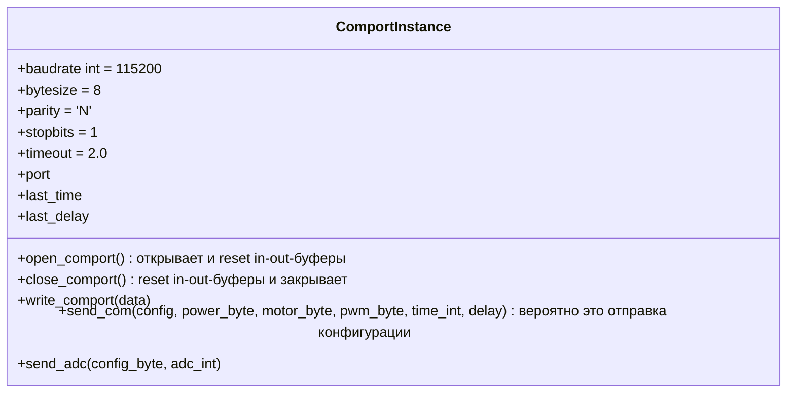

# wiki_cybermed

| | | | | |
| -- | -- | -- | -- | -- |
| config | Конфигурация | | 0-5 бит поднимаются под команды ниже, 1 - присутствует параметр в запросе, 0 - отсутствует, 6,7 - не задействованы | |
| power_byte | Исполнение команды ? | (0) | 1/0, а если 0 - то что и зачем? | |
| motor_byte | Номер двигателя и команда вращения | (1) | 0-2 бита - 0 до 4, 3-4 бита - (0 стоп, 1 - вправо, 2 -вправо?, 3 - удержание) | |
| pwm_byte | ШИМ | (2) | от 0 до 100 - какие попугаи? | |
| time_int | Время работы | (3) | от 0 до 100, где 1 == 0.1 | |
| delay | Задержка исполнения команды | (4) | от 0 до 100, где 1 == 0.1 | |
|  adc_int  | Разрешение АЦП (5) | получение измерений на АЦП? | |

